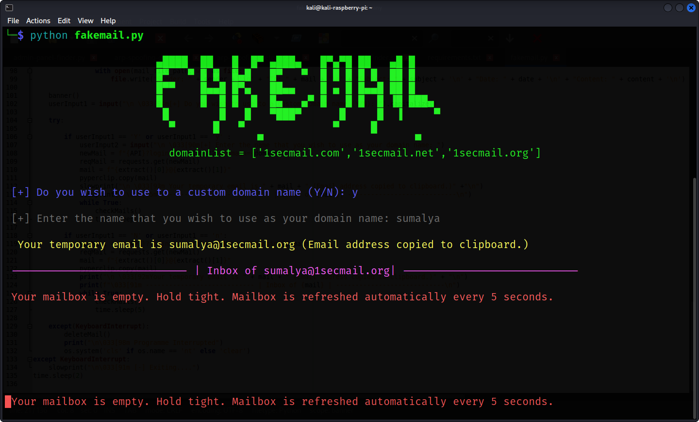

## [!] Fake Mail
## -> Don't use your personal email for unwanted purposes. Just use this email. It helps you to let grant unauthorised permission. 
## Keep your personal mailbox clean
## Output :

